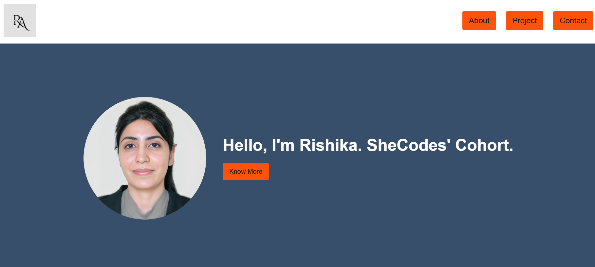

# Rishika Arora - Portfolio Task

[My portfolio link](https://RishA22.github.io/)

## Project Requirements

### Content

- Profile Picture:
  The profile picture is included on the home page.
  

- Biography:
  A Short biography is included on the next page, ' Biography Page'. Firstly, the education column is added and a paragraph is written. The text included in the biography is as follows:
  "An ambitious, hard-working and disciplined IT graduate with a strong academic and practical background. Good background in Mathematics and Statistics. Thrive on challenging myself with exciting projects with a team consisting of people with diverse knowledge backgrounds."

- Functional Contact Form:
  The contact form made using Formspree.io, which sends email to the host when any user submit the form.

- "Projects" section:
  It included three projects. First one is linked to github and other two hasn't been linked yet as they are to be completed in future. 

- Links to external:
  Links to Github and Linkedin are added to the home page. The link to LinkedIn is added to the contact page.

### Technical

- The following webpages are added to the portfolio: Home and about.
- To track the working of the project and the changes made on each step, I used Git as the version
  controller. I have made several changes creating the developer branch and I can see those changes on Git.
- The portfolio project is pushed to the remote Git repository. The project is deployed on Github where
  we can make changes by navigating the directory that contains the deployed website.
- Use media queries for responsive design so that the design can be effectively visible on desktop,
  mobile phone, and any other device as per the screen size.
- To define different parts of the HTML page, sematic HTML tags like: header, nav, article, div, section are used.

### Bonus

- Button containers are used in CSS files defining the cursor shape, color on select, color on and after hover. Those containers are reused for different elements.
-Functional hamburger menu

### Screenshots

-Mobile view:

- Desktop view:

